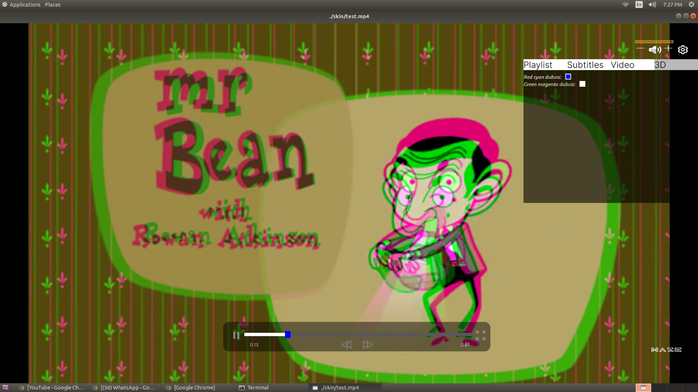

#to enable ffplay 
    sudo apt-get install libsdl2-dev apt install libsdl2-ttf-dev

#Run configure with below params.
./configure --pkg-config-flags=--static --libdir=/usr/local/lib --disable-shared --enable-debug=2 --disable-optimizations --enable-static --enable-gpl --enable-pthreads --enable-nonfree --disable-x86asm --enable-libx264 --enable-filters --enable-runtime-cpudetect --disable-lzma --disable-vaapi --enable-ffplay --disable-stripping  --disable-iconv --extra-cflags="-I/opt/homebrew/opt/sdl2/include -I/opt/homebrew/opt/x264/include" --extra-ldflags="-L/opt/homebrew/opt/sdl2/lib -L /opt/homebrew/opt/x264/lib" --enable-sdl2

Font build:
PKG_CONFIG_PATH="/usr/local/fontconfig-static/lib/pkgconfig:/usr/local/static-freetype/lib/pkgconfig:/usr/local/static-libpng/lib/pkgconfig:usr/local/static-libiconv/lib/pkgconfig"

./configure --prefix=/usr/local/fontconfig-static --enable-static --disable-shared \
CPPFLAGS="-I/usr/local/static-freetype/include -I/usr/local/static-libpng/include -I/usr/local/static-libiconv/include" \
LDFLAGS="-L/usr/local/static-freetype/lib -L/usr/local/static-libpng/lib -L/usr/local/static-libiconv/lib" \
LIBS="-lpng16 -lfreetype -liconv"
make -j$(nproc)

## MAC FFMpeg static build configs:

# TAG Stable build  

PKG_CONFIG_PATH="/usr/local/sdl2-static/lib/pkgconfig:/usr/local/x264-static/lib/pkgconfig:/opt/homebrew/Cellar/sdl2_ttf/2.24.0/lib/pkgconfig:/usr/local/static-expat/lib/pkgconfig:/usr/local/static-bzip2/lib/pkgconfig:/usr/local/static-zlib/lib/pkgconfig:/usr/local/static-brotli/lib/pkgconfig:/usr/local/static-libiconv/lib/pkgconfig" \
./configure --pkg-config-flags=--static \
    --prefix=/usr/local/ffmpeg-static \
    --extra-cflags="-I/usr/local/sdl2-static/include -I/usr/local/x264-static/include -I/opt/homebrew/Cellar/sdl2_ttf/2.24.0/include/SDL2 -I/usr/local/fontconfig-static/include -I/usr/local/static-expat/include -I/usr/local/static-bzip2/include -I/usr/local/static-zlib/include -I/usr/local/static-brotli/include -I/usr/local/static-libiconv/include" \
    --extra-ldflags="-L/usr/local/sdl2-static/lib -L/opt/homebrew/Cellar/sdl2_ttf/2.24.0/lib -L/usr/local/x264-static/lib -L/usr/local/fontconfig-static/lib -L/usr/local/static-expat/lib -L/usr/local/static-bzip2/lib -L/usr/local/static-zlib/lib -L/usr/local/static-brotli/lib  -L/usr/local/static-libiconv/lib" \
    --extra-libs="-lpthread -lm -lexpat -lbz2 -lz -lbrotlidec -lbrotlicommon -liconv" \
    --enable-gpl \
    --enable-nonfree \
    --enable-static \
    --disable-shared \
    --enable-libx264 \
    --enable-filters \
    --enable-runtime-cpudetect \
    --disable-lzma \
    --disable-vaapi \
    --enable-ffplay \
    --enable-sdl2 \
    --disable-stripping \
    --disable-iconv \
    --disable-doc \
    --disable-x86asm \
    --enable-libfontconfig --disable-xlib  --disable-libxcb

#make
make clean && make -j64

Note: 
For static build we need to rename sdl2, h264 dynamic libs in the their installed path.

# For windows

# Steps to generate ffmpeg binaries on windows:=
1. Downaload repo form here - https://github.com/m-ab-s/media-autobuild_suite.git
2. Run with minimal options selecting shared ffmpeg binaries, See attached files for referencce.
3. Replace 'https://git.ffmpeg.org/ffmpeg.git' with 'https://git.ffmpeg.org/ffmpeg.git#tag=release/4.1' in 'media-suite_compile.sh'. See attached files for referencce.
4. In first run it will show some configuration flags, correct them.
5. During compilation, it will show compilation error for libfdk, replace attached file with problematic file and rerun.
6. Run gitbash and apply the above  patch -p1 < ffmpeg4_1.patch
7. Run mingw64_shell.bat and compile it with make
8. Now build will compete and ffmpeg binaries will be placed in 'bin-video' subfolder.

enable x264 , fdkaac cuda and nvenc at media-autobuild_suite

dubleclick  media-autobuild_suite to start the build process

# With command line 

https://trac.ffmpeg.org/wiki/CompilationGuide/MinGW

install MSYS2 from ​https://msys2.github.io/.

Then run the mingw64_shell.bat command in the MSYS2 installation home. Be careful not to run the MSYS2 Shell as this will result in FFmpeg's configure saying building an MSYS binary is not recommended and exiting.

Now install requisite packages:

pacman -S make

pacman -S diffutils

pacman -S yasm

https://stackoverflow.com/questions/54164545/how-to-compile-ffmpeg-for-windows-statically-with-msys2-environment

msys2_shell.cmd -mingw64
./configure --pkg-config-flags=--static --disable-shared --enable-static --enable-gpl --disable-w32threads --disable-autodetect

#For Subtitles

ffmpeg -i test4k.mp4 -f srt -i subtitles.srt -map 0:0 -map 0:1 -map 1:0 -c:v copy -c:a copy -c:s mov_text outputsubtiles.mp4

ffmpeg -i subtitles.mp4 -i subtitles.srt -c copy -c:s mov_text outfile.mp4

To split mp4

ffmpeg -i Bunny720p.mp4 -ss 00:10:00 -to 00:20:30 -c copy output2.mp4
